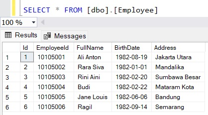
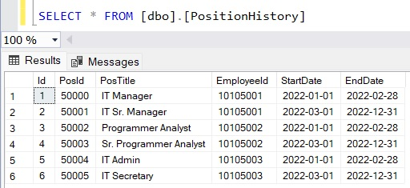
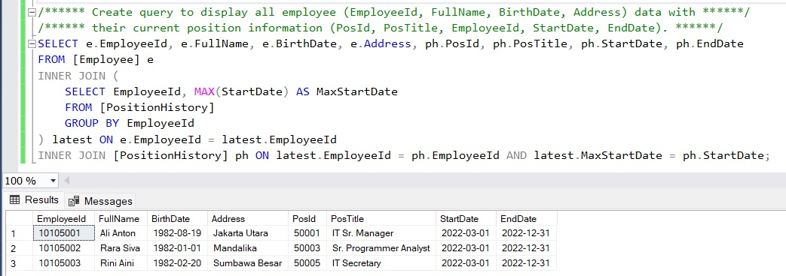
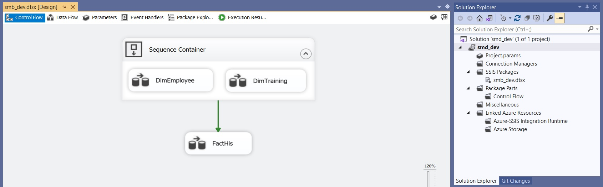
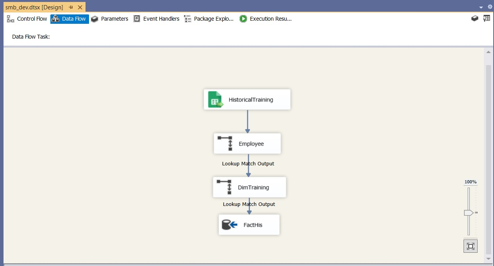
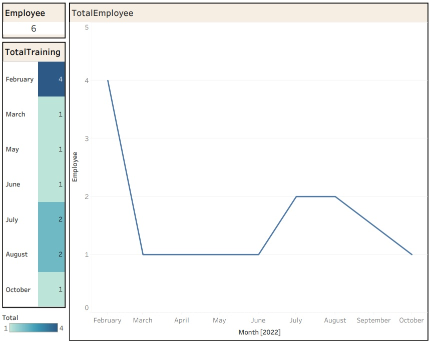

# Assessment Test

This project is created for the purpose of a technical test.
_All data used in this project are dummy._

## Task 1 - Data and Query Task (Basic)

In this task, the focus is on working with data and executing queries. You will need to perform the following steps:

### Step 1: Acquire the required dataset.

### Step 2: Analyze the dataset and understand its structure.

### Step 3: Formulate relevant queries to extract specific information from the dataset.

- [Google_Sheet](https://docs.google.com/spreadsheets/d/11kQci4IgDsSDujaE18dguuW7br-Swcr7TY8NnoSvybk/edit?usp=sharing)

### Step 4: Implement the queries and retrieve the desired results.

## Task 2 - ETL, Data Warehouse, and Analytics

This task involves designing an ETL (Extract, Transform, Load) flow using SSIS (SQL Server Integration Services) and creating a simple dashboard using Tableau for analytics. The steps for this task are as follows:

### Step 1: Identify the data sources for the ETL process.

### Step 2: Define the transformations required to convert the source data into a suitable format for analysis.

### Step 3: Use SSIS to implement the ETL flow, including data extraction, transformation, and loading into a data warehouse.

### Step 4: Design a simple dashboard using a suitable analytics tool to visualize and present the analyzed data.

- [Tableau Public](https://public.tableau.com/views/AnalyticsHis/AnalyticsTrainHis?:language=en-GB&:display_count=n&:origin=viz_share_link)

## Getting Started

To get started with this project, follow these steps:

1. Clone the repository.
2. Install any required dependencies or libraries.
3. Execute the tasks outlined above in order, starting with Task 1.
4. Refer to the individual task folders for specific instructions and additional documentation.
5. For any questions or issues, please refer to the contact information provided in the project.

## Resources

Here are some additional resources that may be helpful for completing this project:

- [SSIS Documentation](https://docs.microsoft.com/en-us/sql/integration-services/sql-server-integration-services?view=sql-server-ver15)
- [Tableau Documentation](https://help.tableau.com/current/pro/desktop/en-us/gettingstarted_overview.htm)

## License

This project is licensed under the [MIT License](LICENSE).
